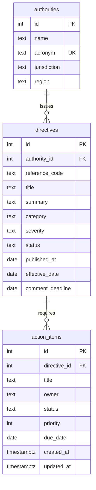

# Artixio Regulatory Triage

A decision-layer app for a regulatory compliance officer: view, filter and triage action items that fall out of directives issued by pharma regulators. Multi-page React app over a FastAPI + PostgreSQL backend. The seed data is deliberately messy; the backend repairs what it safely can, quarantines what it cannot, and the UI shows exactly what was caught.

Stack: PostgreSQL 16, Python 3.11+ / FastAPI / SQLAlchemy 2.0 / Pydantic v2, React 18 / Vite / TypeScript, TanStack Table + TanStack Query, Framer Motion.

## Run it (about 3 minutes)

Prerequisites: Docker, Python 3.11+, Node 18+.

**1. Database**

```bash
docker compose up -d
```

Starts Postgres on `localhost:5432` (user `artixio`, password `artixio`, db `regintel`). Already have Postgres? Skip Docker and set `DATABASE_URL` in `backend/.env` instead.

**2. Backend + seed**

```bash
cd backend
python -m venv .venv && source .venv/bin/activate      # Windows: .venv\Scripts\activate
pip install -r requirements.txt
cp .env.example .env
python seed.py                                          # drops, creates and seeds all tables
uvicorn app.main:app --port 8787 --reload
```

API docs: http://localhost:8787/docs

**3. Frontend**

```bash
cd frontend
npm install
npm run dev
```

Open http://localhost:5173. Vite proxies `/api` to the backend, so no CORS setup is needed in dev.

## Schema

```
authorities 1 ──── n directives 1 ──── n action_items
```



**Authority** is the regulator (EMA, FDA, HPRA...). **Directive** is a single published update from that regulator, with the dates that drive compliance planning. **Action item** is the internal work a directive creates, owned by a person, with a status the officer changes during triage.

Two deliberate choices:

- `status` and `severity` are plain `TEXT`, not Postgres enums. Real feeds arrive with `RESOLVD`, `Pending `, `In-Progress`. A DB enum would reject the row before the application could see it. The DB stores what the source sent; the API normalises on read and only ever writes canonical codes. This is the same reason `reference_code` is not `UNIQUE`: duplicates are a real-world condition the app has to surface, not a constraint violation to hide.
- Dates are nullable on purpose. A missing effective date is one of the most common and most dangerous gaps in regulatory data, so the app has to represent it and flag it rather than fake a value.

## How messy data is handled

Every row read from the DB passes through `backend/app/triage.py` before it reaches a response. Nothing raises; every anomaly becomes a `flag` on the record:

| Seeded anomaly | What the backend does | Flag |
|---|---|---|
| `RESOLVD`, `Pending `, `In-Progress`, `closed`, `wip` | Mapped to the canonical code via an alias table | `code_normalised` (warn) |
| `IN_LIMBO`, `ACTIVE??`, `sev1` | Quarantined as `unknown`; UI shows it and lets a human pick the real value | `unknown_code` (error) |
| HTML in titles (`<script>`, `<b>`) | Tags stripped, raw kept for audit | `html_stripped` |
| Control characters, mojibake | Removed | `control_chars`, `bad_encoding` |
| Title `"   "`, `N/A`, `TBD`; owner `null` | Treated as missing | `placeholder_text` (error if required) |
| Priority 0 / 9 | Clamped to 1..5 | `priority_out_of_range` |
| Missing `effective_date` / `published_at` | Surfaced, never defaulted | `missing_date` (error) |
| Effective before published, deadline before published | Cross-field check | `date_conflict` (error) |
| Publication year 1970, due date 2099 | Plausibility check | `implausible_date` |
| Same reference code with different case/whitespace | Normalised and linked to the owning directive | `code_format`, `duplicate_reference` |
| Withdrawn directive with open action items | Cross-entity check | `status_conflict` (error) |
| Open item past due date | Computed against today | `overdue` |

Writes are strict. `PUT /api/action-items/{id}/status` uses a Pydantic model with `extra="forbid"`; it rejects unknown fields, non-canonical codes, the `unknown` bucket, and illegal transitions (for example blocked -> resolved) with a structured 422 the UI renders inline. Filters on status, severity and flags run on the *cleaned* values, because the raw column is not trustworthy.

## API

| Method | Path | Purpose |
|---|---|---|
| GET | `/api/action-items` | List with `q`, `status` (repeatable), `authority_id`, `severity`, `flagged`, `errors_only`, `sort`, `order`, `limit`, `offset` |
| GET | `/api/action-items/{id}` | Single item with directive and flags |
| PUT | `/api/action-items/{id}/status` | Change status (validated transitions) |
| PATCH | `/api/action-items/{id}` | Update owner / priority / due date / status |
| GET | `/api/directives` | Directives with flags, `authority_id`, `flagged` |
| GET | `/api/directives/{id}` | Directive with its action items |
| GET | `/api/authorities` | Regulators |
| GET | `/api/anomalies` | Counts by flag code and status |
| GET | `/api/health` | DB connectivity |

## UI

Four routes, one product. The triage screen is the core deliverable; the other pages give the same data a front door.

| Route | What it is |
|---|---|
| `/` | Overview: live counts, status mix, regulators covered, latest directives, top anomaly codes |
| `/triage` | The decision layer. Dense TanStack table, filters, detail panel, keyboard-driven status changes |
| `/directives` | Every directive as a card with its flags; filter by authority, flagged, clean |
| `/directives/:id` | One directive with its action items, each with an inline status control, plus every flag with the raw value |
| `/anomalies` | Every rule the triage layer runs, how many times it fired, and what it does about it |

The triage screen is built for keyboard use:

| Key | Action |
|---|---|
| `j` / `k` or arrows | Move selection |
| `1` `2` `3` `4` | Set Pending / In progress / Blocked / Resolved on the selected item |
| `f` | Toggle "flagged only" |
| `e` | Toggle "needs review" (errors only) |
| `/` | Focus search |
| `Esc` | Close panel |

Status changes are optimistic (TanStack Query) and roll back with the server's message if rejected. Rows with a red left bar carry an error-level flag; the flag chips in the last column and the detail panel show each anomaly with the raw stored value.

## Layout

```
backend/
  app/models.py        SQLAlchemy schema
  app/triage.py        sanitisation + flagging rules (pure functions, no DB)
  app/serializers.py   ORM row -> API object through the triage layer
  app/schemas.py       Pydantic read/write contracts
  app/routers/         action_items, directives, anomalies
  seed.py              messy data generator (every anomaly listed at the top)
frontend/
  src/lib/api.ts       typed client
  src/pages/           Overview, TriagePage, DirectivesPage, DirectiveDetail, AnomaliesPage
  src/components/      Nav, Footer, FilterBar, TriageTable, DetailPanel, StatusControl
  vercel.json          SPA fallback + /api rewrite to the Render backend
render.yaml            Render blueprint: Postgres + FastAPI web service
```

## Deploying

Render (API + Postgres) and Vercel (frontend). See [DEPLOY.md](DEPLOY.md).
