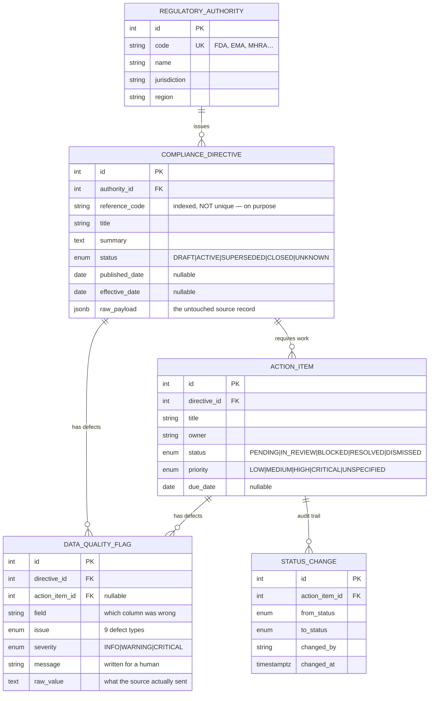

# Artixio — Regulatory Intelligence Triage Pipeline

A decision-layer application for a regulatory compliance officer: ingest simulated
regulatory updates from multiple authorities, catch the defects in that data on the
way in, and present the result as a dense multi-screen operations console.

**Stack:** PostgreSQL 16 · FastAPI + SQLAlchemy 2.0 + Pydantic v2 · React 18 + Vite +
React Router + TanStack Query/Table · TypeScript.

**Screens:** Updates (triage queue) · Update detail · Authorities · Directives ·
Action Items · Data Quality · Saved Views · API Health · Settings.

---

## Quickstart

Two commands. Postgres and the API run in Docker; the frontend runs on your host.

```bash
docker compose up -d --build      # Postgres + API, schema created and seeded automatically
cd web && pnpm install && pnpm dev
```

Then open **http://localhost:5173**.

- Frontend → http://localhost:5173
- API docs (Swagger) → http://localhost:8000/docs
- Health check → http://localhost:8000/health

`npm install && npm run dev` works identically if you prefer npm.

**Requirements:** Docker Desktop (running) and Node 18+. Nothing else — you do not
need Python or Postgres installed locally.

The database seeds itself on first boot. It is idempotent, so `docker compose up`
on an already-populated database leaves your triage decisions intact.

<details>
<summary><b>Reseed from scratch</b></summary>

```bash
docker compose exec api python -m app.seed.seed --reset
```

</details>

<details>
<summary><b>Running the API without Docker</b></summary>

You still need a Postgres. Point `DATABASE_URL` at it and:

```bash
cp .env.example .env
cd api
python -m venv .venv && source .venv/bin/activate
pip install -r requirements.txt
python -m app.seed.seed --reset
uvicorn app.main:app --reload
```

Note that Postgres is published on **5433**, not 5432, so it never collides with a
Postgres you already have running.

</details>

<details>
<summary><b>Ports already in use?</b></summary>

Change the left-hand side of the port mappings in `docker-compose.yml`
(`5433:5432` for Postgres, `8000:8000` for the API). If you move the API port, set
`VITE_API_URL` before starting the frontend.

</details>

---

## Deploying (Render + Vercel)

Optional — the assignment only asks for a repo you can run locally. `render.yaml`
and `web/vercel.json` are committed so a live copy takes a few minutes.

**1 · API and database on Render.** Dashboard → New → Blueprint → pick this repo.
Render reads `render.yaml`, creates the Postgres instance and the API, and wires
`DATABASE_URL` between them. The schema is created and seeded on first boot, so
there is no separate migration step. Note the service URL it gives you.

**2 · Frontend on Vercel.** New Project → import the repo → set **Root Directory
to `web`**. Before deploying, replace `artixio-api.onrender.com` in
`web/vercel.json` with your actual Render URL — that rewrite proxies `/api/*` and
`/health` through Vercel, so the browser only ever talks to one origin and CORS
never enters the picture.

<details>
<summary><b>Calling the API directly instead of proxying</b></summary>

Set `VITE_API_URL=https://your-api.onrender.com` in Vercel's environment
variables and delete the two API rewrites from `vercel.json`. You must then set
`CORS_ORIGINS` on Render to your Vercel origin. The proxy route above avoids all
of this, which is why it is the default.

</details>

### What had to change to make this deployable

Four things would have failed on a hosted platform, each of them quietly:

| Problem | Why it fails | Fix |
|---|---|---|
| Render supplies `postgres://…` | SQLAlchemy 2 removed that alias; the engine raises at import, so the process dies before logging anything | `config.py` rewrites the scheme to `postgresql+psycopg://` — covered by `tests/test_config.py` |
| Bare `postgresql://` picks psycopg2 | Only psycopg v3 is in `requirements.txt` | Same rewrite names the driver explicitly |
| Dockerfile hardcoded port 8000 | Render assigns `$PORT`; the app would start, bind the wrong port, and fail health checks with a clean log | `CMD` uses shell form and `${PORT:-8000}`, so compose is unaffected |
| `allow_credentials=True` with `origins=["*"]` | Browsers reject that combination outright — every request fails client-side with nothing on the server | Set to `False`; this API sends no cookies and reads no auth header |
| Database and service in different regions | Render injects the database's *internal* hostname, and internal DNS is per-region. The service cannot resolve it and dies during startup with `Name or service not known` | Both resources pin `region: frankfurt` in `render.yaml`; omitting `region` defaults to Oregon rather than inheriting |
| An unreachable database killed the process | `Application startup failed. Exiting.` — the platform reads that as a crash and retries, so a transient database problem looks like a broken image | Startup polls the database with backoff, then starts degraded. `/health` reports `database: unreachable` and stays up to say so |

### Free-tier caveats worth knowing before you share the link

- Render free web services **sleep after 15 minutes idle**. The first request
  after that takes roughly 50 seconds while the container wakes, and the UI will
  sit in its loading state throughout. Load the page once before demoing it.
- Render's free Postgres **expires after 30 days**. Fine for a submission window,
  not for anything longer.
- The deployed database is seeded but otherwise shared — anyone with the link can
  change statuses. That is the intended demo behaviour; reseed with
  `docker compose exec api python -m app.seed.seed --reset` locally, or from
  Render's shell, to reset it.

---

## The database schema

Five tables. Three model the regulatory domain, and two exist because the assignment's
hard part is not storing clean data — it is staying honest about dirty data.



### Why it is shaped this way

**The hierarchy is the real one.** An authority issues directives; a directive
generates the work a compliance team actually does. Action items hang off directives
rather than living in a flat task table because a task's regulatory context — who
issued it, when it takes effect — is what determines its urgency. Denormalising that
would mean recomputing urgency in every query.

**`DataQualityFlag` is an entity, not a log line.** This is the central design
decision. The naive approach validates on input and rejects bad rows, which loses
exactly the records a compliance officer most needs to see. The alternative — accept
everything and hope — is what the assignment calls silently accepting corrupt logic.

Making defects a table means "this record is dirty" becomes *queryable*: the API can
filter by severity, sort by risk, and count defects per authority, and the UI can
prove its warnings by citing the field, the reason, and the original value. A flag is
tied to a directive and optionally narrowed to a specific action item, so
item-level problems do not get attributed to the parent.

**`reference_code` is indexed but deliberately not unique.** Source registers really
do emit the same code twice. A unique constraint would make the second record fail to
insert, which converts a data-quality problem into an availability problem. Instead
both rows land and the collision is flagged.

**Critical dates are nullable, and that is a feature.** `published_date`,
`effective_date` and `due_date` genuinely arrive missing. A `NOT NULL` with a default
would fabricate a compliance deadline — the single most dangerous thing this system
could do. The schema stores NULL, the pipeline raises a CRITICAL flag, and the UI
renders `— missing` in red.

**`raw_payload` keeps the original.** Every cleaned field can be traced back to what
actually arrived. It is the difference between "we cleaned it" and "we can prove what
we cleaned", and it is visible in the detail panel under *Source record as received*.

**`StatusChange` makes it a decision layer.** In a regulated context, who moved an
item to Resolved and when is part of the record. Without it this is CRUD with extra
steps.

---

## The messy data

**Every record is fabricated.** Nothing was scraped, downloaded, or derived from a
real regulatory source. The authorities are real bodies and the documents are written
to be plausible — reference-code formats, therapeutic areas and document types follow
real conventions — but the directives themselves, their reference codes and their
`example/` URLs are invented for this exercise. The domain realism is deliberate; the
data is not real, and no part of it should be treated as regulatory guidance.

Nothing here is pre-cleaned. `api/app/seed/raw_data.py` holds the raw feed with
deliberate defects; the seeder pushes it through **the same normalisation functions
the API would use for live ingestion** (`api/app/normalize.py`). The `_defect`
annotations in the raw data are stripped before ingestion and never consulted — the
pipeline finds the problems on its own.

The current seed produces **20 detected issues across 13 of 16 directives**.

| # | Anomaly planted | What the pipeline does |
|---|---|---|
| D1 | Missing effective date | Stores NULL + **CRITICAL** `MISSING_REQUIRED_DATE` — nobody can schedule the work |
| D2 | Impossible date `2024-13-45`, `"sometime in Q1"` | Stores NULL + **CRITICAL** `UNPARSEABLE_DATE`. Refuses to guess |
| D3 | Human-written `"March 3rd, 2024"` | **Parses it** to `2024-03-03`. No flag — coercible input is not a defect |
| D4 | Effective date precedes published date | **CRITICAL** `ILLOGICAL_DATE_ORDER` — a cross-field check |
| D5 | Mojibake `â€"`, `qualité`; double-encoded `&amp;#8212;` | Repaired to `—`, `qualité`, `Q&A` + INFO `MALFORMED_TEXT` |
| D6 | Embedded HTML in summary | Tags stripped, text preserved + INFO flag |
| D7 | Status `PARTIALLY_RESCINDED_SEE_ANNEX_C` | Stored as `UNKNOWN` + WARNING `UNKNOWN_ENUM_VALUE`. Row survives |
| D8 | Duplicate reference code across records | **Both rows kept** + WARNING `DUPLICATE_REFERENCE_CODE` |
| D9 | Missing reference code | WARNING `MISSING_REFERENCE_CODE` |
| D10 | Directive `CLOSED` with 2 action items still open | **CRITICAL** `CONFLICTING_STATUS` — each row is valid, the combination is not |
| D11 | Priority `"URGENT!!!"`, `"P1"` | Coerced to `HIGH` / `CRITICAL` via an alias table |
| D12 | Upstream truncation marker `[truncated]` | WARNING `TRUNCATED_CONTENT` |
| D13 | Title is only markup: `<div class='title'>   </div>` | Placeholder `[untitled directive — REF]`, italicised in the UI, + WARNING |
| D14 | `DRAFT` directive with already-resolved work | WARNING `CONFLICTING_STATUS` |

The three rules `normalize.py` never breaks:

> **Never crash. Never silently accept. Never drop the row.**

An unparseable value becomes NULL *and* a flag. An unknown enum becomes a safe
fallback *and* a flag. A record with five defects is still ingested, still
triageable, and still carries all five.

---

## API

| Method | Path | Purpose |
|---|---|---|
| `GET` | `/api/directives` | Filter, sort, paginate. Params: `q`, `authority[]`, `status[]`, `severity[]`, `issue[]`, `triage[]`, `owner[]`, `flagged_only`, `has_open_items`, `overdue_only`, `sort`, `order`, `page`, `page_size` |
| `GET` | `/api/directives/{id}` | Detail, including flags, action items and `raw_payload` |
| `GET` | `/api/directives/{id}/neighbours` | Previous/next ids for the record stepper |
| `POST` | `/api/directives/{id}/action-items` | Create tracked work (strict validation) |
| `POST` | `/api/directives/{id}/flags` | Raise a manual data-quality issue |
| `POST` | `/api/directives/{id}/revalidate` | Re-run the ingest rules over the stored raw payload |
| `GET` | `/api/action-items` | Work across all directives; filter by status, owner, priority, overdue, unassigned |
| `GET` | `/api/action-items/owners` | Distinct assignees for the Assign Owner control |
| `PATCH` | `/api/action-items/{id}` | Partial update: status, owner, priority, due date |
| `GET` | `/api/flags` | The corrupt-record register |
| `POST` | `/api/flags/{id}/resolve` · `/reopen` | Acknowledge or reopen an issue |
| `GET` | `/api/authorities` | Authorities with portfolio stats |
| `GET` | `/api/meta/counts` | Aggregate counts driving filters and nav badges |
| `GET` | `/health` | Liveness, latency, row counts, ingest summary |

### Two validation postures, on purpose

Ingestion **coerces and flags** — a regulator's feed is not going to be re-sent, so a
bad value is stored as NULL with a flag rather than rejected. Officer-entered data
(`POST` action items, manual flags) is **validated strictly and rejected** with a 422 —
we can ask the person at the keyboard what they meant.

### Derived, never stored

`triage_status`, `primary_owner` and `next_due_date` are computed from action items on
read (`api/app/rollup.py`). Storing them would mean every write has to remember to
update them, and the day someone forgets, the queue lies about what is outstanding.

The catch: the queue *filter* needs the same definition in SQL. Two definitions of one
concept is a bug waiting to happen, so `tests/test_rollup.py` enumerates every
combination of action-item statuses up to length three and asserts the Python and SQL
definitions agree on all of them, and that the four buckets partition the space
exactly.

### Validation behaviour

| Situation | Response |
|---|---|
| Unknown status value in body | `422` from Pydantic before any DB access |
| Item not found | `404` |
| **Illegal workflow transition** | `409` with a human-readable reason |
| Unexpected server error | `500` with a structured JSON body, never a dropped connection |

Transitions are a deliberately non-total graph (`api/app/triage.py`). The rule worth
defending: **a `BLOCKED` item cannot jump straight to `RESOLVED`** — the blocker has
to be explicitly cleared first. Try it in the UI and the server refuses with:

> *A blocked item cannot be resolved directly. Move it back to Pending or In Review
> first, so the blocker is explicitly cleared.*

The dropdown intentionally offers every status rather than greying out illegal ones.
The server is the single authority on what is legal; mirroring those rules in the
client would create two sources of truth that drift apart.

---

## The interface

A slate-and-blue console: dark slate sidebar against a light slate workspace, blue
for action and selection, 6px radii, DM Sans for display type, Inter for body and
JetBrains Mono for codes. Implemented from a Figma Make prototype of this same
brief, whose signature move is kept — **rows carrying unresolved data-quality
issues are tinted and edge-marked**, so a dirty record is visible while scanning
rather than only on reaching the Validation column.

**Screens and routes**

| Route | Screen | What it is for |
|---|---|---|
| `/updates` | Regulatory Updates | The triage queue — the primary surface |
| `/updates/:id` | Update detail | One record: overview, action items, data quality, raw source |
| `/authorities` | Authorities | Issuing bodies ranked by workload; drills through to a filtered queue |
| `/directives` | Directives | The document library, tabbed by lifecycle state |
| `/action-items` | Action Items | Assigned work across all directives, editable inline |
| `/data-quality` | Data Quality | The corrupt-record register |
| `/saved-views` | Saved Views | Named filter sets |
| `/api-health` | API Health | Service, database, latency, ingest summary |
| `/settings` | Settings | Preferences, plus read-only validation and workflow rules |

**Design rules held throughout**

- **Verified contrast, not assumed contrast.** Every text/background pair was
  measured against WCAG AA — 32 pairs, all passing (body 17.9:1, secondary 7.6:1,
  tertiary 5.0:1, sidebar idle text 7.0:1). Five of the prototype's own values
  failed and were corrected rather than copied: its sidebar labels measured 3.8:1,
  its control borders 2.8:1, and its amber row marker 2.1:1 against the very tint
  it sits on. Control borders clear the 3:1 non-text threshold because a white
  input on a slate page has almost no fill contrast, so the border is the only
  thing identifying the control.
- **Meaning is never carried by colour alone.** Severity always ships with a word or
  letter (`CRITICAL`, `2C 1W`); the coloured row gutter is redundant with the
  Severity column, never the sole signal. Active nav uses tint *plus* weight *plus*
  an edge marker. In Progress and Resolved differ by a filled vs hollow dot as well
  as by hue.
- **One accent, used sparingly.** Muted blue marks what is interactive or selected.
  Red/amber/blue-tinted surfaces mean data quality. Nothing glows or saturates — in
  a tool someone stares at all day, visual noise costs attention that belongs on the
  data.
- **36px rows, 13px table type**, on an 8px grid, with a compact/comfortable toggle
  in Settings. Metric tiles exist but are deliberately small; nav badges and tab
  counts carry most of the numbers.
- Honours `prefers-reduced-motion`.
- **Risk-first by default** — the queue sorts by critical-flag count descending.
- **Missing dates render as `missing` in red.** An absent effective date is a finding,
  not an empty cell.
- **Optimistic updates with rollback.** An illegal transition surfaces the server's
  actual reason in a toast rather than a generic failure.
- **Keyboard triage:** <kbd>j</kbd>/<kbd>k</kbd> walk rows, <kbd>enter</kbd> opens,
  <kbd>/</kbd> focuses search.

**Interactions wired to real endpoints:** view details · assign owner · change status ·
resolve action · flag record · validate data · create action item · acknowledge/reopen
issue · save view · export CSV · back to queue · previous/next record.

Export writes the **currently filtered and sorted rows** — an export that silently
returns a different result set than the one on screen is worse than no export. Cells
beginning `=`, `+`, `-` or `@` are prefixed so a CSV cannot smuggle a formula into
Excel.

---

## Project layout

```
├── docker-compose.yml         Postgres + API
├── .env.example
├── NOTES.md                   AI-workflow log (see below)
├── api/
│   ├── Dockerfile
│   ├── requirements.txt
│   └── app/
│       ├── main.py            App, CORS, lifespan seeding, 500 handler
│       ├── config.py          Pydantic settings
│       ├── db.py              Engine + session dependency
│       ├── models.py          SQLAlchemy models — the schema
│       ├── schemas.py         Pydantic API contracts
│       ├── normalize.py       ★ The ingest pipeline. Pure functions, no DB
│       ├── rollup.py          Derived directive-level status
│       ├── triage.py          Status transition rules
│       ├── routers/           directives · action_items · flags · meta
│       └── seed/
│           ├── raw_data.py    ★ The deliberately messy mock feed
│           └── seed.py        Pushes raw data through the real pipeline
└── web/
    └── src/
        ├── api.ts             Typed client, mirrors the Pydantic contracts
        ├── App.tsx            Routes
        ├── styles.css         The design system
        ├── components/        Sidebar · PageHeader · ui.tsx (pills, modal, toast)
        ├── lib/               CSV export · saved views · formatting
        └── pages/             One file per screen
```

`normalize.py` holds no database imports, so every coercion rule is directly
unit-testable without a Postgres. 62 tests cover the coercion rules, the transition
graph, and the rollup parity described above:

```bash
docker compose exec api pytest -q
```

---

## AI workflow

[`NOTES.md`](./NOTES.md) records two bugs that came out of AI-assisted work on this
build, with what was generated, why it was wrong, how I caught it, and the fix:

1. A shared "null-ish" vocabulary that would have made legitimate `"pending"` and
   `"unknown"` status values register as missing data — attaching false flags
   without failing a single test.
2. A Vite proxy rule (`"/api"`) that also captured the client-side route
   `/api-health`, and left `/health` unproxied so the health check parsed HTML as
   JSON. Both only showed up because I curled every route instead of assuming.
