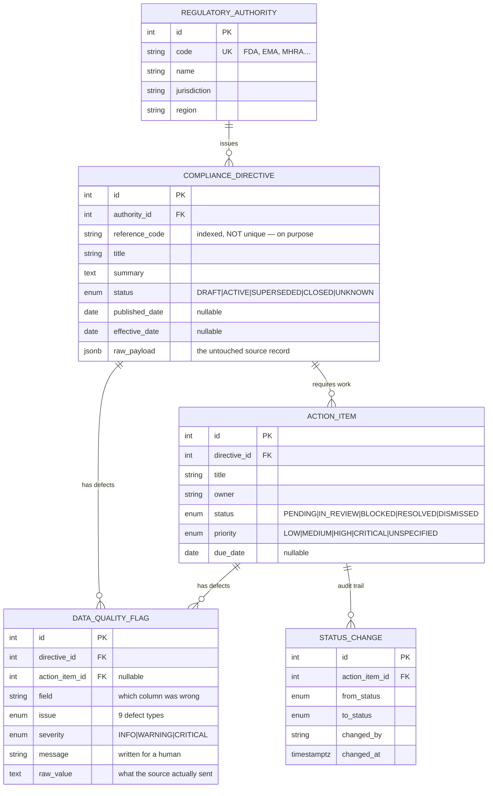

# Regulatory Intelligence Triage Pipeline

A decision-layer application for a regulatory compliance officer: ingest simulated
regulatory updates from multiple authorities, catch the defects in that data on the
way in, and present the result as a dense triage queue that can be worked with a
keyboard.

**Stack:** PostgreSQL 16 · FastAPI + SQLAlchemy 2.0 + Pydantic v2 · React 18 + Vite +
TanStack Query/Table · TypeScript.

---

## Quickstart

Two commands. Postgres and the API run in Docker; the frontend runs on your host.

```bash
docker compose up -d --build      # Postgres + API, schema created and seeded automatically
cd web && pnpm install && pnpm dev
```

Then open **http://localhost:5173**.

- Frontend → http://localhost:5173
- API docs (Swagger) → http://localhost:8000/docs
- Health check → http://localhost:8000/health

`npm install && npm run dev` works identically if you prefer npm.

**Requirements:** Docker Desktop (running) and Node 18+. Nothing else — you do not
need Python or Postgres installed locally.

The database seeds itself on first boot. It is idempotent, so `docker compose up`
on an already-populated database leaves your triage decisions intact.

<details>
<summary><b>Reseed from scratch</b></summary>

```bash
docker compose exec api python -m app.seed.seed --reset
```

</details>

<details>
<summary><b>Running the API without Docker</b></summary>

You still need a Postgres. Point `DATABASE_URL` at it and:

```bash
cp .env.example .env
cd api
python -m venv .venv && source .venv/bin/activate
pip install -r requirements.txt
python -m app.seed.seed --reset
uvicorn app.main:app --reload
```

Note that Postgres is published on **5433**, not 5432, so it never collides with a
Postgres you already have running.

</details>

<details>
<summary><b>Ports already in use?</b></summary>

Change the left-hand side of the port mappings in `docker-compose.yml`
(`5433:5432` for Postgres, `8000:8000` for the API). If you move the API port, set
`VITE_API_URL` before starting the frontend.

</details>

---

## The database schema

Five tables. Three model the regulatory domain, and two exist because the assignment's
hard part is not storing clean data — it is staying honest about dirty data.



### Why it is shaped this way

**The hierarchy is the real one.** An authority issues directives; a directive
generates the work a compliance team actually does. Action items hang off directives
rather than living in a flat task table because a task's regulatory context — who
issued it, when it takes effect — is what determines its urgency. Denormalising that
would mean recomputing urgency in every query.

**`DataQualityFlag` is an entity, not a log line.** This is the central design
decision. The naive approach validates on input and rejects bad rows, which loses
exactly the records a compliance officer most needs to see. The alternative — accept
everything and hope — is what the assignment calls silently accepting corrupt logic.

Making defects a table means "this record is dirty" becomes *queryable*: the API can
filter by severity, sort by risk, and count defects per authority, and the UI can
prove its warnings by citing the field, the reason, and the original value. A flag is
tied to a directive and optionally narrowed to a specific action item, so
item-level problems do not get attributed to the parent.

**`reference_code` is indexed but deliberately not unique.** Source registers really
do emit the same code twice. A unique constraint would make the second record fail to
insert, which converts a data-quality problem into an availability problem. Instead
both rows land and the collision is flagged.

**Critical dates are nullable, and that is a feature.** `published_date`,
`effective_date` and `due_date` genuinely arrive missing. A `NOT NULL` with a default
would fabricate a compliance deadline — the single most dangerous thing this system
could do. The schema stores NULL, the pipeline raises a CRITICAL flag, and the UI
renders `— missing` in red.

**`raw_payload` keeps the original.** Every cleaned field can be traced back to what
actually arrived. It is the difference between "we cleaned it" and "we can prove what
we cleaned", and it is visible in the detail panel under *Source record as received*.

**`StatusChange` makes it a decision layer.** In a regulated context, who moved an
item to Resolved and when is part of the record. Without it this is CRUD with extra
steps.

---

## The messy data

Nothing here is pre-cleaned. `api/app/seed/raw_data.py` holds the raw feed with
deliberate defects; the seeder pushes it through **the same normalisation functions
the API would use for live ingestion** (`api/app/normalize.py`). The `_defect`
annotations in the raw data are stripped before ingestion and never consulted — the
pipeline finds the problems on its own.

The current seed produces **20 detected issues across 13 of 16 directives**.

| # | Anomaly planted | What the pipeline does |
|---|---|---|
| D1 | Missing effective date | Stores NULL + **CRITICAL** `MISSING_REQUIRED_DATE` — nobody can schedule the work |
| D2 | Impossible date `2024-13-45`, `"sometime in Q1"` | Stores NULL + **CRITICAL** `UNPARSEABLE_DATE`. Refuses to guess |
| D3 | Human-written `"March 3rd, 2024"` | **Parses it** to `2024-03-03`. No flag — coercible input is not a defect |
| D4 | Effective date precedes published date | **CRITICAL** `ILLOGICAL_DATE_ORDER` — a cross-field check |
| D5 | Mojibake `â€"`, `qualité`; double-encoded `&amp;#8212;` | Repaired to `—`, `qualité`, `Q&A` + INFO `MALFORMED_TEXT` |
| D6 | Embedded HTML in summary | Tags stripped, text preserved + INFO flag |
| D7 | Status `PARTIALLY_RESCINDED_SEE_ANNEX_C` | Stored as `UNKNOWN` + WARNING `UNKNOWN_ENUM_VALUE`. Row survives |
| D8 | Duplicate reference code across records | **Both rows kept** + WARNING `DUPLICATE_REFERENCE_CODE` |
| D9 | Missing reference code | WARNING `MISSING_REFERENCE_CODE` |
| D10 | Directive `CLOSED` with 2 action items still open | **CRITICAL** `CONFLICTING_STATUS` — each row is valid, the combination is not |
| D11 | Priority `"URGENT!!!"`, `"P1"` | Coerced to `HIGH` / `CRITICAL` via an alias table |
| D12 | Upstream truncation marker `[truncated]` | WARNING `TRUNCATED_CONTENT` |
| D13 | Title is only markup: `<div class='title'>   </div>` | Placeholder `[untitled directive — REF]`, italicised in the UI, + WARNING |
| D14 | `DRAFT` directive with already-resolved work | WARNING `CONFLICTING_STATUS` |

The three rules `normalize.py` never breaks:

> **Never crash. Never silently accept. Never drop the row.**

An unparseable value becomes NULL *and* a flag. An unknown enum becomes a safe
fallback *and* a flag. A record with five defects is still ingested, still
triageable, and still carries all five.

---

## API

| Method | Path | Purpose |
|---|---|---|
| `GET` | `/api/directives` | Filter, sort, paginate. Query params: `q`, `authority[]`, `status[]`, `severity[]`, `issue[]`, `flagged_only`, `has_open_items`, `sort`, `order`, `page`, `page_size` |
| `GET` | `/api/directives/{id}` | Detail, including flags, action items and `raw_payload` |
| `GET` | `/api/action-items/{id}` | Single item with its audit trail |
| `PATCH` | `/api/action-items/{id}` | Change status. Records a `StatusChange` |
| `GET` | `/api/authorities` | Authority list |
| `GET` | `/api/meta/counts` | Aggregate counts driving the filter rail |
| `GET` | `/health` | Liveness + database reachability |

### Validation behaviour

| Situation | Response |
|---|---|
| Unknown status value in body | `422` from Pydantic before any DB access |
| Item not found | `404` |
| **Illegal workflow transition** | `409` with a human-readable reason |
| Unexpected server error | `500` with a structured JSON body, never a dropped connection |

Transitions are a deliberately non-total graph (`api/app/triage.py`). The rule worth
defending: **a `BLOCKED` item cannot jump straight to `RESOLVED`** — the blocker has
to be explicitly cleared first. Try it in the UI and the server refuses with:

> *A blocked item cannot be resolved directly. Move it back to Pending or In Review
> first, so the blocker is explicitly cleared.*

The dropdown intentionally offers every status rather than greying out illegal ones.
The server is the single authority on what is legal; mirroring those rules in the
client would create two sources of truth that drift apart.

---

## The interface

Built for someone processing a queue, not admiring a dashboard. There are no
oversized metric tiles — the counts live inline in the top bar and, more usefully, as
badges on each filter, so you can see where the volume is *before* clicking.

- **26px rows, 13px type.** The whole working set is visible without scrolling.
- **Colour means exactly one thing: data-quality severity.** A 4px gutter bar on
  every row is scannable down the whole column; nothing else is coloured, so red is
  never ambiguous.
- **Risk-first by default.** The table sorts by critical-flag count descending —
  triage starts with what is most broken.
- **Missing dates render as `— missing` in red**, because an absent effective date is
  a finding, not an empty cell.
- **Flag counts per row** as `2C 1W` (critical/warning/info); the detail panel
  expands each into field, reason, and the original value the source sent.
- **Optimistic status updates** via TanStack Query — the UI moves immediately and
  rolls back with an explanation if the server refuses.
- **Keyboard triage:** <kbd>j</kbd>/<kbd>k</kbd> to walk rows, <kbd>/</kbd> to
  search, <kbd>esc</kbd> to close the panel.
- Light and dark themes follow the OS setting.

---

## Project layout

```
├── docker-compose.yml         Postgres + API
├── .env.example
├── NOTES.md                   AI-workflow log (see below)
├── api/
│   ├── Dockerfile
│   ├── requirements.txt
│   └── app/
│       ├── main.py            App, CORS, lifespan seeding, 500 handler
│       ├── config.py          Pydantic settings
│       ├── db.py              Engine + session dependency
│       ├── models.py          SQLAlchemy models — the schema
│       ├── schemas.py         Pydantic API contracts
│       ├── normalize.py       ★ The ingest pipeline. Pure functions, no DB
│       ├── triage.py          Status transition rules
│       ├── routers/           directives · action_items · meta
│       └── seed/
│           ├── raw_data.py    ★ The deliberately messy mock feed
│           └── seed.py        Pushes raw data through the real pipeline
└── web/
    └── src/
        ├── api.ts             Typed client, mirrors the Pydantic contracts
        ├── App.tsx            Filter state, keyboard nav, layout
        ├── styles.css         Density system
        └── components/        FilterRail · DirectiveTable · DetailPanel
```

`normalize.py` holds no database imports, so every coercion rule is directly
unit-testable without a Postgres.

---

## AI workflow

[`NOTES.md`](./NOTES.md) records a bug an AI tool introduced during this build — a
shared "null-ish" vocabulary that would have made legitimate `"pending"` and
`"unknown"` status values register as missing data, attaching false flags without
failing a single test. It covers what was generated, why it was wrong, how I caught
it, and the fix.
